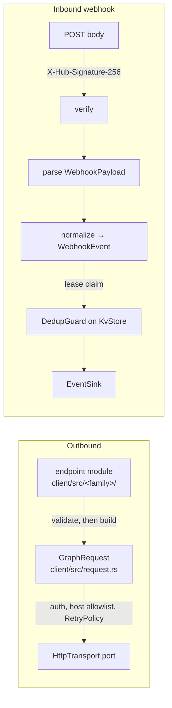

# CLAUDE.md

This file provides guidance to Claude Code (claude.ai/code) when working with code in this repository.

@AGENTS.md

## Claude Code specifics

- Project skills: `.claude/skills/` — `meta-docs` (look up the real spec),
  `add-graph-endpoint`, `add-webhook-field`, `error-tree`, `verify-gate`,
  `typst-templates`. Load the matching one before starting that kind of
  work.
- Project agents: `.claude/agents/` — `meta-docs-researcher` (spec
  extraction), `wa-implementer` (draft a module), `wa-sabotage-reviewer`
  (adversarial review-and-fix, mutation-driven), `wa-security-reviewer`
  (secrets, signatures, crypto, tokens), `wa-conventions-reviewer` (public
  API, blast radius, docs/skills parity).
- Pipeline for non-trivial work: implement → sabotage review with a
  distinct lens → remediate → re-run the original failure → `just ci` on the
  final head, exit code read from a file.
- The devcontainer (`.devcontainer/`) is a default-deny sandbox with the
  toolchain, `just`, `cargo-deny`, `typst`, and Postgres/Redis sidecars.

## Running one test

`just test` runs everything with `--all-features`. For a tight loop:

- One integration test file: `cargo test -p meta-whatsapp-webhooks --test signature`
- One unit test by name filter: `cargo test -p meta-whatsapp-client --all-features messages::`
- Tests behind a feature (`axum`, `postgres`, `typst`, `flows-endpoint`)
  need it enabled: add `--all-features` when in doubt.
- Consumer-skill examples: `cargo test -p meta-whatsapp-rs --all-features --test skills`
- Service core tests (no database, no HTTP):
  `cargo test -p meta-whatsapp-server-core`; one module:
  `cargo test -p meta-whatsapp-server-core idempotency::`.
- Service tests: `cargo test -p meta-whatsapp-server --all-features`;
  after changing a route, regenerate the spec with
  `cargo run -p meta-whatsapp-server -- openapi > crates/meta-whatsapp-server/openapi/v1.json`
  and review the diff (within v1 a change must be additive).
- Event data snapshots (after a webhook change in the library):
  `META_WHATSAPP_SERVER_UPDATE_SNAPSHOTS=1 cargo test -p meta-whatsapp-server --all-features --test event_data`,
  then review what it wrote under `crates/meta-whatsapp-server/tests/snapshots/event_data/`.
- `live_*` adapter and service tests need real services: `just test-live` (or set
  `META_WHATSAPP_RS_TEST_POSTGRES_URL` / `META_WHATSAPP_RS_TEST_REDIS_URL`
  and `META_WHATSAPP_RS_REQUIRE_LIVE=1`).

A filtered run is feedback, not verification — `just ci` still has to pass.

## Architecture in one screen

Hexagonal workspace. `meta-whatsapp-core` owns the error tree, ids,
secrets and the **ports** (`HttpTransport`, `KvStore`, `ConversationStore`,
`EventSink`, `Clock`); it does no I/O. Dependency rule: everything depends
on core; no library crate depends on the `meta-whatsapp-rs` facade (binaries
may: the service's crates do); `client` and
`webhooks` never depend on each other or on `adapters` (dev-deps aside);
adapter library types (sqlx, reqwest, redis) never leak through a port.

- **Outbound**: one module per Graph endpoint family under
  `crates/meta-whatsapp-client/src/`; each exposes `client.<family>(id)`
  and goes through `GraphRequest` (`client.get_at/post_at/delete_at(&[segments])`).
  POSTs are non-idempotent unless marked; `RetryPolicy` never replays a
  timed-out send. `client.with_token(t)` switches tenant (merchant token
  from the vault).
- **Inbound**: `crates/meta-whatsapp-webhooks` — a body that verifies but
  fails to parse is acknowledged and surfaced as `WebhookEvent::Unparsed`;
  unknown fields/types parse into `Unknown { raw }`. Dedup is a lease
  (pending → done/released), not a pre-delivery marker.
- **Typed stores are built on `KvStore`**, never as new ports: token vault,
  OTP challenges, webhook dedup, Embedded Signup sessions. Conformance
  suites for adapters live in `meta_whatsapp_adapters::store::conformance`
  and `::conversation_conformance`.
- **Facade** `crates/meta-whatsapp-rs`: re-exports, `prelude`, the CMS
  `inbox` (conversation store + 24-hour-window-guarded replies), feature
  flags selecting adapters, and the runnable `examples/`.
- **Service** `crates/meta-whatsapp-server`: the HTTP binary for apps not
  written in Rust (`docs/design/server.md`, `docs/guides/server.md`), on
  `crates/meta-whatsapp-server-core`, its framework-free core (domain,
  authorization, error model as data, and the ports its memory and
  Postgres backends implement: `RecordStore`, `IdempotencyRecords`,
  `Outbox`, `LeaderLock`, `Janitor`, `SchemaMigrator`, bundled as a
  `Backend`). The service's crates depend on the facade and on each
  other; the library never depends on them. Workspace members but not
  default ones; the OpenAPI document (`openapi/v1.json`) is generated from
  code and committed (a test compares them); `tests/errors.rs` reads the
  error table from the design doc's §5.2.
- **Stable identifiers** (`wa-rs/token-vault/v1`, `wa.token`, `wa.otp.*`,
  `wa.es.session`, `wa.webhook.dedup`, table prefix `wa_`) predate the
  rename and are pinned by tests: they are encrypted/hashed into stored
  data. Do not "fix" them to the new name — that is a data migration.
  Full table: `docs/architecture.md` § Stable identifiers.

## Gotchas

- `.xtask/` is a **separate workspace** with its own `Cargo.lock`
  (excluded from the root so its `ring`-based TLS never enters library
  builds); `just lint`/`just deny` check it by manifest path.
- `just features` checks each feature alone — a missing `#[cfg(feature)]`
  gate (including on an intra-doc link) hides behind `--all-features`.
- `just skills-check` needs full git history and `origin/main`; it fails
  in a shallow clone.
- `just ci` needs **Node 24** (`tools/skills-ts/.nvmrc`): `just skills-ts`
  type-checks the server skills' TypeScript against the committed OpenAPI
  document.
- PRs are **squash-merged**: cite "PR #N", never a branch commit, in docs;
  the squash body is `just squash-body <pr>` so skill stamps resolve on main
  (CONTRIBUTING.md § Merging).
- **A library-only webhook change can fail the server's tests.**
  `meta-whatsapp-server/tests/event_data.rs` walks
  `meta-whatsapp-webhooks/tests/fixtures` (a new fixture needs its
  snapshot; a changed snapshot is a v1 API change, where only additions
  are allowed) and text-parses `WebhookEvent::kind` in `src/event.rs` (a
  new kind must be classified in `TENANT_EVENT_TYPES` or
  `OPERATOR_EVENT_TYPES`, `crates/meta-whatsapp-server-core/src/events.rs`).
  Steps: `.claude/skills/add-webhook-field`.
- Consumer skills' Rust blocks are excerpts of
  `skills/<name>/examples/*.rs`; README snippets are excerpts of
  `crates/meta-whatsapp-rs/examples/` (`tests/readme.rs`). Change the
  example file, then the excerpt, or the test fails.
